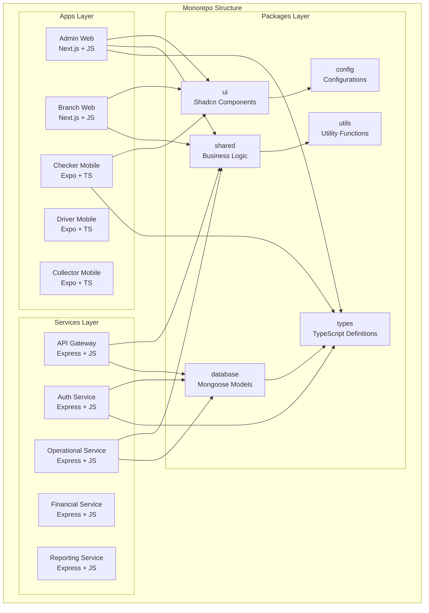
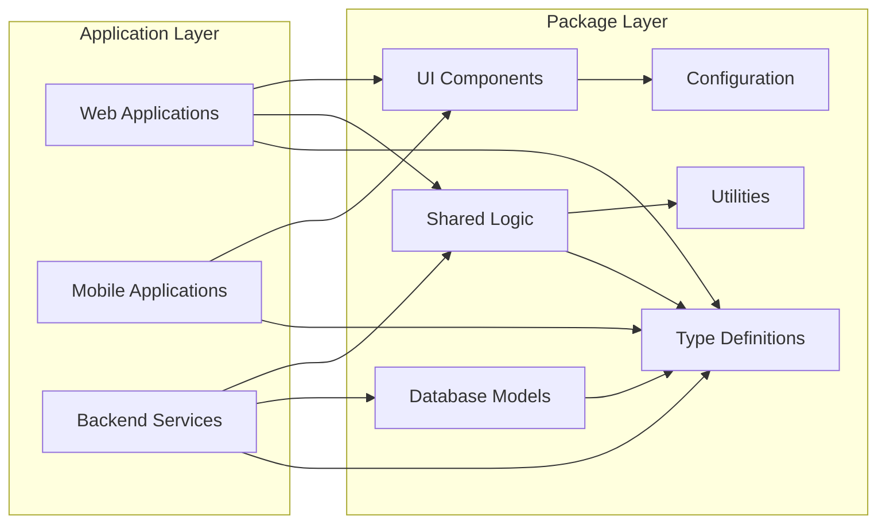

# **Software Requirement Specification (SRS) - Updated**

# **Sistem ERP PT. Sarana Mudah Raya (Samudra Paket)**

**Versi Dokumen:** 1.1  
**Tanggal Pembuatan:** 27 April 2025  
**Update Terakhir:** 24 Mei 2025  
**Disusun oleh:** Business Analyst, System Analyst, Akuntan  
**Status Dokumen:** Draft

## **Riwayat Revisi**

| Versi | Tanggal | Deskripsi Perubahan | Dibuat oleh |
|-------|---------|-------------------|-------------|
| 0.1 | 18 April 2025 | Initial draft | Business Analyst |
| 0.5 | 22 April 2025 | Penambahan kebutuhan fungsional dan non-fungsional | System Analyst |
| 0.8 | 25 April 2025 | Penambahan kebutuhan modul keuangan dan akuntansi | Akuntan |
| 1.0 | 27 April 2025 | Finalisasi dokumen | Business Analyst, System Analyst |
| 1.1 | 24 Mei 2025 | Update arsitektur Monorepo Turborepo | System Analyst |

## **Update: Arsitektur Software dengan Monorepo**

### **2.1 Perspektif Produk - Updated**

Sistem ERP Samudra Paket akan dibangun menggunakan **Monorepo architecture dengan Turborepo** sebagai build system orchestration. Arsitektur ini memungkinkan:

#### **Unified Codebase Structure**
```
samudra-erp/
├── apps/
│   ├── admin-web/              # Admin Dashboard (Next.js + JavaScript)
│   ├── branch-web/             # Branch Portal (Next.js + JavaScript)  
│   ├── checker-mobile/         # Checker App (Expo + TypeScript)
│   ├── driver-mobile/          # Driver App (Expo + TypeScript)
│   ├── collector-mobile/       # Debt Collector App (Expo + TypeScript)
│   ├── api-gateway/            # API Gateway (Express.js + JavaScript) 
│   ├── auth-service/           # Authentication Service
│   ├── operational-service/    # Operational Logic Service
│   ├── financial-service/      # Financial Logic Service
│   └── reporting-service/      # Reporting Service
├── packages/
│   ├── ui/                     # Shared UI Components (Shadcn UI)
│   ├── shared/                 # Business Logic Utilities
│   ├── database/               # MongoDB Models & Utilities  
│   ├── types/                  # Shared TypeScript Types
│   ├── validation/             # Validation Schemas
│   ├── constants/              # Business Constants
│   ├── config/                 # Shared Configurations
│   └── utils/                  # Utility Functions
└── tools/
    ├── build/                  # Build Tools & Scripts
    ├── generators/             # Code Generators
    └── deploy/                 # Deployment Scripts
```

### **3. Kebutuhan Fungsional - Architecture Update**

#### **3.1.1 Shared Package Requirements**

| ID | Kebutuhan | Prioritas | Deskripsi |
|----|-----------|-----------| ----------|
| FR-ARCH-01 | Shared UI Components | Tinggi | Sistem harus menyediakan consistent UI components yang dapat digunakan di web dan mobile applications |
| FR-ARCH-02 | Business Logic Sharing | Tinggi | Core business logic harus dapat digunakan di multiple services tanpa duplikasi |
| FR-ARCH-03 | Type Safety | Tinggi | Shared types harus memastikan type safety across all applications dan services |
| FR-ARCH-04 | Validation Consistency | Tinggi | Validation rules harus konsisten di frontend dan backend melalui shared schemas |
| FR-ARCH-05 | Configuration Management | Sedang | Environment dan application configs harus centralized dan consistent |

#### **3.1.2 Monorepo Development Workflow**

| ID | Kebutuhan | Prioritas | Deskripsi |
|----|-----------|-----------| ----------|
| FR-ARCH-06 | Hot Reloading | Tinggi | Development environment harus support hot reloading across dependent packages |
| FR-ARCH-07 | Incremental Builds | Tinggi | Build system harus support incremental builds berdasarkan file changes |
| FR-ARCH-08 | Dependency Graph | Sedang | System harus dapat menampilkan dependency graph antar packages |
| FR-ARCH-09 | Parallel Development | Tinggi | Multiple developers harus dapat bekerja pada different packages simultaneously |
| FR-ARCH-10 | Package Versioning | Sedang | System harus support independent versioning untuk each package |

### **4. Kebutuhan Non-Fungsional - Architecture Update**

#### **4.1 Kebutuhan Performa - Monorepo Specific**

| ID | Kebutuhan | Prioritas | Deskripsi |
|----|-----------|-----------| ----------|
| NF-MR-01 | Build Performance | Tinggi | Full monorepo build harus selesai dalam waktu kurang dari 10 menit |
| NF-MR-02 | Incremental Build | Tinggi | Incremental builds harus selesai dalam waktu kurang dari 2 menit |
| NF-MR-03 | Package Install Time | Sedang | Package installation harus selesai dalam waktu kurang dari 5 menit |
| NF-MR-04 | Hot Reload Time | Tinggi | Hot reload untuk changes harus kurang dari 3 detik |
| NF-MR-05 | Memory Usage | Sedang | Development environment harus menggunakan kurang dari 8GB RAM |

#### **4.2 Kebutuhan Maintainability - Monorepo Specific**

| ID | Kebutuhan | Prioritas | Deskripsi |
|----|-----------|-----------| ----------|
| NF-MR-06 | Code Sharing Rate | Tinggi | Minimal 30% code harus shared across applications |
| NF-MR-07 | Dependency Management | Tinggi | Package dependencies harus centrally managed dengan version consistency |
| NF-MR-08 | Documentation | Tinggi | Each package harus memiliki README dan API documentation |
| NF-MR-09 | Testing Strategy | Tinggi | Shared testing utilities dan strategies across packages |
| NF-MR-10 | Code Quality | Tinggi | Consistent linting, formatting, dan code quality rules |

### **5. Diagram dan Model - Architecture Update**

#### **5.1 Monorepo Architecture Diagram**



#### **5.2 Package Dependency Flow**



### **6. Technical Implementation - Monorepo Specifications**

#### **6.1 Turborepo Configuration**

**turbo.json Configuration:**
```json
{
  "pipeline": {
    "build": {
      "dependsOn": ["^build"],
      "outputs": ["dist/**", ".next/**", "build/**"]
    },
    "test": {
      "dependsOn": ["build"],
      "outputs": ["coverage/**"]
    },
    "lint": {
      "outputs": []
    },
    "type-check": {
      "dependsOn": ["^build"],
      "outputs": []
    },
    "dev": {
      "cache": false,
      "persistent": true
    }
  }
}
```

#### **6.2 Package Manager Strategy**

- **Primary**: PNPM untuk efficient node_modules management
- **Workspace Configuration**: PNPM workspaces untuk package linking
- **Lock File**: pnpm-lock.yaml untuk deterministic installs
- **Cache Strategy**: PNPM store sharing untuk disk space efficiency

#### **6.3 Development Scripts**

**Root package.json scripts:**
```json
{
  "scripts": {
    "dev": "turbo run dev",
    "build": "turbo run build",
    "test": "turbo run test",
    "lint": "turbo run lint",
    "type-check": "turbo run type-check",
    "clean": "turbo run clean",
    "changeset": "changeset",
    "version-packages": "changeset version",
    "release": "turbo run build && changeset publish"
  }
}
```

### **7. Prioritas Kebutuhan - Architecture Update**

#### **7.1 Monorepo Setup Priority**

**Fase 0: Monorepo Foundation (2 minggu)**
- Turborepo configuration
- Package structure setup  
- CI/CD pipeline adaptation
- Developer tooling setup
- Documentation dan training materials

#### **7.2 Package Development Priority**

**High Priority Packages:**
1. `@samudra/types` - Type definitions
2. `@samudra/config` - Configuration management
3. `@samudra/ui` - UI component library
4. `@samudra/database` - Database models
5. `@samudra/shared` - Business logic utilities

**Medium Priority Packages:**
1. `@samudra/validation` - Validation schemas
2. `@samudra/utils` - Utility functions
3. `@samudra/constants` - Business constants

### **8. Quality Assurance - Monorepo Specific**

#### **8.1 Testing Strategy**

- **Unit Tests**: Per package testing dengan Jest
- **Integration Tests**: Cross-package testing
- **E2E Tests**: Full application flow testing
- **Visual Tests**: UI component visual regression testing

#### **8.2 Code Quality**

- **Linting**: ESLint configuration shared across packages
- **Formatting**: Prettier configuration consistency
- **Type Checking**: TypeScript strict mode untuk type safety
- **Bundle Analysis**: Bundle size monitoring per application

### **Development Workflow Requirements**

#### **Developer Experience Requirements**

| ID | Requirement | Priority | Description |
|----|-------------|----------|-------------|
| DX-01 | Fast Development Setup | High | New developers harus dapat setup development environment dalam < 30 menit |
| DX-02 | Clear Package Documentation | High | Setiap package harus memiliki clear README dengan usage examples |
| DX-03 | Automated Code Generation | Medium | Code generators untuk common patterns (components, services, etc.) |
| DX-04 | Development Scripts | High | Standardized scripts untuk common development tasks |
| DX-05 | Error Handling | High | Clear error messages untuk build failures dan dependency issues |

#### **CI/CD Requirements**

| ID | Requirement | Priority | Description |
|----|-------------|----------|-------------|
| CI-01 | Incremental CI | High | CI pipeline harus hanya test dan build affected packages |
| CI-02 | Parallel Jobs | High | Independent packages harus dapat di-build secara parallel |
| CI-03 | Cache Optimization | High | Build artifacts harus di-cache untuk faster subsequent builds |
| CI-04 | Deployment Orchestration | High | Coordinated deployment untuk dependent services |
| CI-05 | Rollback Strategy | High | Ability untuk rollback individual services atau full system |

## **Kesimpulan Architecture Update**

Penggunaan Monorepo dengan Turborepo memberikan foundation yang solid untuk sistem ERP yang complex dengan multiple applications dan shared components. Benefits include:

1. **Improved Developer Experience**: Unified development environment
2. **Code Consistency**: Shared components dan business logic
3. **Faster Development**: Code reuse dan shared utilities
4. **Better Maintainability**: Centralized dependencies dan configurations
5. **Quality Assurance**: Consistent testing dan code quality across all packages

Meskipun ada initial complexity dalam setup, long-term benefits untuk development velocity dan system maintainability sangat signifikan untuk project scale ini.

*[Konten asli SRS tetap sama, dengan penambahan architectural requirements di atas]*