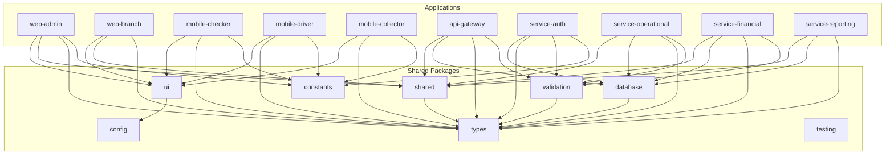

# **Technical Design Document (TDD) - Updated**

# **Sistem ERP PT. Sarana Mudah Raya (Samudra Paket)**

**Dokumen Versi:** 1.1  
**Tanggal:** 26 April 2025  
**Update Terakhir:** 24 Mei 2025  
**Status Dokumen:** Draft  
**Disusun oleh:** Software Architect, Database Engineer, UI/UX Designer, DevOps Engineer

## **Changelog**

| Versi | Tanggal | Deskripsi Perubahan | Dibuat oleh |
|-------|---------|-------------------|-------------|
| 1.0 | 26 April 2025 | Initial version | Software Architect |
| 1.1 | 24 Mai 2025 | Update arsitektur Monorepo Turborepo | Software Architect, DevOps Engineer |

## **Update: Monorepo Architecture dengan Turborepo**

### **1. Arsitektur Monorepo Overview**

Sistem ERP Samudra Paket akan dibangun menggunakan **Monorepo architecture dengan Turborepo** sebagai build system orchestration. Arsitektur ini dipilih untuk mendukung kompleksitas sistem ERP dengan multiple applications, shared components, dan coordinated deployments.

#### **1.1 Monorepo Structure**

```
samudra-erp-monorepo/
├── apps/
│   ├── web-admin/              # Admin Dashboard (Next.js + JavaScript)
│   │   ├── src/
│   │   ├── public/
│   │   ├── package.json
│   │   └── next.config.js
│   ├── web-branch/             # Branch Management (Next.js + JavaScript)
│   │   ├── src/
│   │   ├── public/
│   │   ├── package.json
│   │   └── next.config.js
│   ├── mobile-checker/         # Checker Mobile App (Expo + TypeScript)
│   │   ├── src/
│   │   ├── app.json
│   │   ├── package.json
│   │   └── tsconfig.json
│   ├── mobile-driver/          # Driver Mobile App (Expo + TypeScript)
│   │   ├── src/
│   │   ├── app.json
│   │   ├── package.json
│   │   └── tsconfig.json
│   ├── mobile-collector/       # Debt Collector App (Expo + TypeScript)
│   │   ├── src/
│   │   ├── app.json
│   │   ├── package.json
│   │   └── tsconfig.json
│   ├── api-gateway/            # API Gateway (Express.js + JavaScript)
│   │   ├── src/
│   │   ├── package.json
│   │   └── Dockerfile
│   ├── service-auth/           # Authentication Service
│   │   ├── src/
│   │   ├── package.json
│   │   └── Dockerfile
│   ├── service-operational/    # Operational Service
│   │   ├── src/
│   │   ├── package.json
│   │   └── Dockerfile
│   ├── service-financial/      # Financial Service
│   │   ├── src/
│   │   ├── package.json
│   │   └── Dockerfile
│   └── service-reporting/      # Reporting Service
│       ├── src/
│       ├── package.json
│       └── Dockerfile
├── packages/
│   ├── ui/                     # Shared UI Components
│   │   ├── src/
│   │   │   ├── components/     # React components (Shadcn UI)
│   │   │   ├── styles/         # Tailwind CSS configurations
│   │   │   └── index.ts
│   │   ├── package.json
│   │   └── tailwind.config.js
│   ├── shared/                 # Business Logic & Utilities
│   │   ├── src/
│   │   │   ├── lib/           # Business logic functions
│   │   │   ├── utils/         # Utility functions
│   │   │   └── index.ts
│   │   └── package.json
│   ├── database/               # Database Models & Utilities
│   │   ├── src/
│   │   │   ├── models/        # Mongoose models
│   │   │   ├── schemas/       # Validation schemas
│   │   │   ├── connections/   # Database connections
│   │   │   └── index.ts
│   │   └── package.json
│   ├── types/                  # Shared TypeScript Types
│   │   ├── src/
│   │   │   ├── api/           # API types
│   │   │   ├── entities/      # Business entity types
│   │   │   └── index.ts
│   │   └── package.json
│   ├── validation/             # Validation Schemas
│   │   ├── src/
│   │   │   ├── schemas/       # Zod/Joi schemas
│   │   │   └── index.ts
│   │   └── package.json
│   ├── constants/              # Business Constants
│   │   ├── src/
│   │   │   ├── business/      # Business constants
│   │   │   ├── system/        # System constants
│   │   │   └── index.ts
│   │   └── package.json
│   ├── config/                 # Shared Configuration
│   │   ├── eslint/            # ESLint configurations
│   │   ├── tailwind/          # Tailwind configurations
│   │   ├── typescript/        # TypeScript configurations
│   │   └── package.json
│   └── testing/                # Shared Testing Utilities
│       ├── src/
│       │   ├── fixtures/      # Test fixtures
│       │   ├── mocks/         # Mock utilities
│       │   └── index.ts
│       └── package.json
├── tools/
│   ├── build/                  # Build Scripts & Tools
│   │   ├── webpack/           # Custom webpack configs
│   │   ├── rollup/            # Rollup configurations
│   │   └── scripts/           # Build scripts
│   ├── generators/             # Code Generators
│   │   ├── component/         # Component generator
│   │   ├── service/           # Service generator
│   │   └── model/             # Model generator
│   └── deploy/                 # Deployment Scripts
│       ├── docker/            # Docker configurations
│       ├── k8s/               # Kubernetes manifests
│       └── railway/           # Railway.com configurations
├── docs/                       # Documentation
│   ├── api/                   # API documentation
│   ├── components/            # Component documentation
│   └── deployment/            # Deployment guides
├── turbo.json                  # Turborepo configuration
├── package.json                # Root package.json
├── pnpm-workspace.yaml         # PNPM workspace configuration
├── tsconfig.json               # Root TypeScript configuration
├── .eslintrc.js                # Root ESLint configuration
└── .prettierrc                 # Prettier configuration
```

#### **1.2 Package Dependencies Graph**



### **2. Turborepo Configuration**

#### **2.1 turbo.json Configuration**

```json
{
  "$schema": "https://turbo.build/schema.json",
  "pipeline": {
    "build": {
      "dependsOn": ["^build"],
      "outputs": [
        "dist/**",
        ".next/**",
        "build/**",
        "lib/**"
      ],
      "env": [
        "NODE_ENV",
        "NEXT_PUBLIC_API_URL",
        "DATABASE_URL",
        "JWT_SECRET"
      ]
    },
    "dev": {
      "cache": false,
      "persistent": true,
      "dependsOn": ["^build"]
    },
    "test": {
      "dependsOn": ["build"],
      "outputs": [
        "coverage/**"
      ],
      "inputs": [
        "src/**/*.tsx",
        "src/**/*.ts",
        "test/**/*.ts",
        "test/**/*.tsx"
      ]
    },
    "test:watch": {
      "cache": false,
      "persistent": true
    },
    "lint": {
      "outputs": []
    },
    "type-check": {
      "dependsOn": ["^build"],
      "outputs": []
    },
    "clean": {
      "cache": false
    },
    "db:generate": {
      "cache": false
    },
    "db:push": {
      "cache": false
    }
  },
  "globalDependencies": [
    "**/.env.*local",
    "tsconfig.json",
    ".eslintrc.js"
  ],
  "globalEnv": [
    "NODE_ENV"
  ]
}
```

#### **2.2 PNPM Workspace Configuration**

**pnpm-workspace.yaml:**
```yaml
packages:
  - "apps/*"
  - "packages/*"
  - "tools/*"
```

**Root package.json:**
```json
{
  "name": "samudra-erp-monorepo",
  "private": true,
  "scripts": {
    "build": "turbo run build",
    "dev": "turbo run dev",
    "test": "turbo run test",
    "test:watch": "turbo run test:watch",
    "lint": "turbo run lint",
    "type-check": "turbo run type-check",
    "clean": "turbo run clean",
    "format": "prettier --write \"**/*.{ts,tsx,js,jsx,json,md}\"",
    "changeset": "changeset",
    "version-packages": "changeset version",
    "release": "turbo run build --filter=./packages/* && changeset publish",
    "db:generate": "turbo run db:generate",
    "db:push": "turbo run db:push",
    "pre-commit": "lint-staged"
  },
  "devDependencies": {
    "@changesets/cli": "^2.26.0",
    "@turbo/gen": "^1.10.0",
    "eslint": "^8.48.0",
    "lint-staged": "^13.2.0",
    "prettier": "^3.0.0",
    "tsup": "^7.2.0",
    "turbo": "latest",
    "typescript": "^5.0.0"
  },
  "engines": {
    "node": ">=18.0.0",
    "pnpm": ">=8.0.0"
  },
  "packageManager": "pnpm@8.6.0"
}
```

### **3. Package Design Details**

#### **3.1 @samudra/ui Package**

**Structure:**
```
packages/ui/
├── src/
│   ├── components/
│   │   ├── forms/             # Form components
│   │   │   ├── pickup-form.tsx
│   │   │   ├── shipment-form.tsx
│   │   │   └── invoice-form.tsx
│   │   ├── tables/            # Data table components
│   │   │   ├── shipment-table.tsx
│   │   │   ├── customer-table.tsx
│   │   │   └── financial-table.tsx
│   │   ├── charts/            # Chart components
│   │   │   ├── revenue-chart.tsx
│   │   │   ├── performance-chart.tsx
│   │   │   └── dashboard-metrics.tsx
│   │   ├── mobile/            # Mobile-specific components
│   │   │   ├── scanner.tsx
│   │   │   ├── signature-pad.tsx
│   │   │   └── camera-capture.tsx
│   │   └── common/            # Common UI components
│   │       ├── button.tsx
│   │       ├── input.tsx
│   │       ├── modal.tsx
│   │       └── loading.tsx
│   ├── styles/
│   │   ├── globals.css
│   │   └── components.css
│   ├── hooks/                 # Custom React hooks
│   │   ├── use-form.ts
│   │   ├── use-table.ts
│   │   └── use-mobile.ts
│   └── index.ts
├── tailwind.config.js
└── package.json
```

**package.json:**
```json
{
  "name": "@samudra/ui",
  "version": "0.1.0",
  "main": "./dist/index.js",
  "module": "./dist/index.mjs",
  "types": "./dist/index.d.ts",
  "exports": {
    ".": {
      "import": "./dist/index.mjs",
      "require": "./dist/index.js",
      "types": "./dist/index.d.ts"
    },
    "./styles": "./dist/styles.css"
  },
  "scripts": {
    "build": "tsup src/index.ts --format esm,cjs --dts --external react --external react-dom",
    "dev": "tsup src/index.ts --format esm,cjs --dts --external react --external react-dom --watch",
    "type-check": "tsc --noEmit",
    "lint": "eslint src/",
    "clean": "rm -rf dist"
  },
  "dependencies": {
    "class-variance-authority": "^0.7.0",
    "clsx": "^2.0.0",
    "lucide-react": "^0.263.1",
    "tailwind-merge": "^1.14.0"
  },
  "devDependencies": {
    "@samudra/config": "workspace:*",
    "@samudra/types": "workspace:*",
    "@types/react": "^18.2.0",
    "@types/react-dom": "^18.2.0",
    "react": "^18.2.0",
    "react-dom": "^18.2.0",
    "tailwindcss": "^3.3.0",
    "tsup": "^7.2.0",
    "typescript": "^5.0.0"
  },
  "peerDependencies": {
    "react": ">=18.0.0",
    "react-dom": ">=18.0.0"
  }
}
```

#### **3.2 @samudra/shared Package**

**Structure:**
```
packages/shared/
├── src/
│   ├── lib/
│   │   ├── pickup/            # Pickup business logic
│   │   │   ├── validation.ts
│   │   │   ├── calculation.ts
│   │   │   └── workflow.ts
│   │   ├── shipment/          # Shipment business logic
│   │   │   ├── pricing.ts
│   │   │   ├── routing.ts
│   │   │   └── tracking.ts
│   │   ├── financial/         # Financial business logic
│   │   │   ├── accounting.ts
│   │   │   ├── invoicing.ts
│   │   │   └── collection.ts
│   │   └── reporting/         # Reporting utilities
│   │       ├── data-aggregation.ts
│   │       ├── chart-data.ts
│   │       └── export.ts
│   ├── utils/
│   │   ├── date.ts
│   │   ├── format.ts
│   │   ├── validation.ts
│   │   └── encryption.ts
│   └── index.ts
└── package.json
```

#### **3.3 @samudra/database Package**

**Structure:**
```
packages/database/
├── src/
│   ├── models/
│   │   ├── user.ts           # User model
│   │   ├── branch.ts         # Branch model
│   │   ├── shipment.ts       # Shipment model
│   │   ├── customer.ts       # Customer model
│   │   ├── payment.ts        # Payment model
│   │   └── index.ts
│   ├── schemas/
│   │   ├── validation/       # Mongoose validation schemas
│   │   └── types/            # Schema type definitions
│   ├── connections/
│   │   ├── mongodb.ts        # MongoDB connection
│   │   ├── redis.ts          # Redis connection
│   │   └── index.ts
│   ├── migrations/
│   │   └── scripts/          # Migration scripts
│   └── index.ts
└── package.json
```

#### **3.4 @samudra/types Package**

**Structure:**
```
packages/types/
├── src/
│   ├── api/
│   │   ├── auth.ts           # Authentication API types
│   │   ├── pickup.ts         # Pickup API types
│   │   ├── shipment.ts       # Shipment API types
│   │   ├── financial.ts      # Financial API types
│   │   └── common.ts         # Common API types
│   ├── entities/
│   │   ├── user.ts           # User entity types
│   │   ├── branch.ts         # Branch entity types
│   │   ├── shipment.ts       # Shipment entity types
│   │   └── customer.ts       # Customer entity types
│   ├── ui/
│   │   ├── forms.ts          # Form types
│   │   ├── tables.ts         # Table types
│   │   └── charts.ts         # Chart types
│   └── index.ts
└── package.json
```

### **4. Development Workflow**

#### **4.1 Developer Setup**

**Prerequisites:**
- Node.js >= 18.0.0
- PNPM >= 8.0.0
- Git

**Setup Commands:**
```bash
# Clone repository
git clone https://github.com/samudra-paket/erp-monorepo.git
cd erp-monorepo

# Install dependencies
pnpm install

# Setup environment variables
cp .env.example .env.local

# Start development servers
pnpm dev
```

#### **4.2 Development Scripts**

**Common Commands:**
```bash
# Development
pnpm dev                    # Start all apps in development mode
pnpm dev --filter=web-admin # Start specific app
pnpm dev --filter=@samudra/ui # Start specific package

# Building
pnpm build                  # Build all packages and apps
pnpm build --filter=./packages/* # Build only packages
pnpm build --filter=./apps/*     # Build only applications

# Testing
pnpm test                   # Run all tests
pnpm test --filter=@samudra/shared # Test specific package
pnpm test:watch             # Run tests in watch mode

# Linting and Type Checking
pnpm lint                   # Lint all packages
pnpm type-check            # Type check all packages
pnpm format                # Format all code

# Database
pnpm db:generate           # Generate database artifacts
pnpm db:push              # Push database changes

# Package Management
pnpm changeset            # Create changeset for release
pnpm version-packages     # Version packages based on changesets
pnpm release             # Build and publish packages
```

#### **4.3 Git Workflow**

**Branch Strategy:**
```
main                       # Production ready code
├── develop               # Integration branch
├── feature/pickup-mobile # Feature branches
├── feature/dashboard-ui  # Feature branches
└── hotfix/urgent-bug     # Hotfix branches
```

**Commit Convention:**
```
feat(ui): add shipment table component
fix(api): resolve authentication bug
docs(readme): update setup instructions
refactor(shared): optimize pricing calculation
test(database): add user model tests
```

### **5. Build and Deployment Strategy**

#### **5.1 Turborepo Build Pipeline**

**Build Phases:**
1. **Package Builds**: Core packages built first
2. **Application Builds**: Apps built after dependencies
3. **Testing**: Comprehensive testing across packages
4. **Deployment**: Coordinated deployment strategy

**Build Optimization:**
- **Incremental Builds**: Only changed packages rebuild
- **Caching**: Turborepo remote caching for CI/CD
- **Parallel Execution**: Independent packages build simultaneously
- **Dependency Awareness**: Builds respect dependency graph

#### **5.2 Railway.com Deployment**

**Service Configuration:**
```yaml
# railway.toml
[build]
builder = "nixpacks"
buildCommand = "pnpm install && pnpm build --filter=${RAILWAY_SERVICE_NAME}"

[deploy]
healthcheckPath = "/health"
healthcheckTimeout = 300
restartPolicyType = "on-failure"

# Environment-specific configurations
[environments.production]
[environments.staging]
[environments.development]
```

**Individual Service Deployments:**
- Each microservice deploys independently
- Shared packages bundled with consuming applications
- Database migrations run before API deployments
- Health checks ensure service readiness

#### **5.3 CI/CD Pipeline**

**GitHub Actions Workflow:**
```yaml
name: CI/CD Pipeline

on:
  push:
    branches: [main, develop]
  pull_request:
    branches: [main]

jobs:
  changes:
    runs-on: ubuntu-latest
    outputs:
      packages: ${{ steps.changes.outputs.packages }}
      apps: ${{ steps.changes.outputs.apps }}
    steps:
      - uses: actions/checkout@v3
      - uses: dorny/paths-filter@v2
        id: changes
        with:
          filters: |
            packages:
              - 'packages/**'
            apps:
              - 'apps/**'

  test:
    needs: changes
    if: needs.changes.outputs.packages == 'true' || needs.changes.outputs.apps == 'true'
    runs-on: ubuntu-latest
    steps:
      - uses: actions/checkout@v3
      - uses: pnpm/action-setup@v2
        with:
          version: 8
      - uses: actions/setup-node@v3
        with:
          node-version: 18
          cache: 'pnpm'
      
      - run: pnpm install --frozen-lockfile
      - run: pnpm run build
      - run: pnpm run test
      - run: pnpm run lint
      - run: pnpm run type-check

  deploy:
    needs: [changes, test]
    if: github.ref == 'refs/heads/main'
    runs-on: ubuntu-latest
    strategy:
      matrix:
        service: [api-gateway, service-auth, service-operational, service-financial, service-reporting, web-admin, web-branch]
    steps:
      - uses: actions/checkout@v3
      - name: Deploy to Railway
        uses: railway/action@v1
        with:
          service: ${{ matrix.service }}
          token: ${{ secrets.RAILWAY_TOKEN }}
```

### **6. Performance Optimization**

#### **6.1 Build Performance**

**Turborepo Caching:**
- Local cache untuk development builds
- Remote cache untuk CI/CD pipeline
- Cache invalidation berdasarkan file changes
- Optimal cache hit rates melalui granular dependencies

**Bundle Optimization:**
- Tree shaking untuk unused code elimination
- Code splitting untuk lazy loading
- Bundle analysis untuk size monitoring
- Shared chunks untuk common dependencies

#### **6.2 Runtime Performance**

**Package Loading:**
- Lazy loading untuk non-critical packages
- Dynamic imports untuk large utilities
- Module federation untuk micro-frontend architecture
- Progressive loading untuk mobile applications

**Memory Management:**
- Efficient dependency resolution
- Garbage collection optimization
- Memory leak prevention
- Resource pooling untuk shared resources

### **7. Monitoring and Observability**

#### **7.1 Build Monitoring**

**Metrics Tracking:**
- Build duration per package
- Cache hit/miss rates
- Dependency resolution time
- Bundle size tracking

**Alerting:**
- Build failure notifications
- Performance regression alerts
- Dependency vulnerability warnings
- Cache efficiency monitoring

#### **7.2 Development Experience Monitoring**

**Developer Metrics:**
- Hot reload performance
- IDE integration effectiveness
- Error resolution time
- Feature development velocity

**Feedback Loops:**
- Developer satisfaction surveys
- Performance bottleneck identification
- Tool effectiveness measurement
- Process improvement tracking

### **8. Security Considerations**

#### **8.1 Dependency Security**

**Vulnerability Management:**
- Automated dependency scanning
- Security advisory monitoring
- Vulnerability patching workflow
- Supply chain security validation

**Access Control:**
- Package publishing permissions
- Repository access controls
- Secrets management for CI/CD
- Code signing for releases

#### **8.2 Development Security**

**Code Quality:**
- Static analysis for security issues
- Dependency audit automation
- Secure coding guidelines enforcement
- Security-focused code reviews

**Environment Security:**
- Development environment isolation
- Secrets management for local development
- Network security for development services
- Data privacy in development/testing

## **Kesimpulan Technical Update**

Implementasi Monorepo dengan Turborepo memberikan foundation teknis yang solid untuk Sistem ERP Samudra Paket dengan benefits berikut:

### **Technical Benefits:**
1. **Unified Development**: Single repository dengan consistent tooling
2. **Efficient Builds**: Intelligent caching dan incremental builds
3. **Code Sharing**: Maksimal reuse untuk business logic dan UI components
4. **Type Safety**: End-to-end type safety across all applications
5. **Coordinated Deployments**: Simplified deployment orchestration

### **Development Benefits:**
1. **Improved DX**: Better developer experience dengan unified workflow
2. **Faster Iterations**: Shared components accelerate feature development
3. **Quality Consistency**: Uniform code quality across all packages
4. **Easy Refactoring**: Cross-package refactoring dengan confidence
5. **Simplified Testing**: Integrated testing strategies

### **Operational Benefits:**
1. **Simplified CI/CD**: Single pipeline untuk multiple applications
2. **Better Monitoring**: Unified monitoring dan observability
3. **Efficient Scaling**: Independent scaling per service
4. **Maintenance Efficiency**: Centralized dependency management

Meskipun ada initial complexity dalam setup dan learning curve, long-term benefits dalam development velocity, code quality, dan system maintainability sangat signifikan untuk project scale Sistem ERP ini.

*[Konten asli TDD tetap sama, dengan penambahan arsitektur Monorepo di atas]*